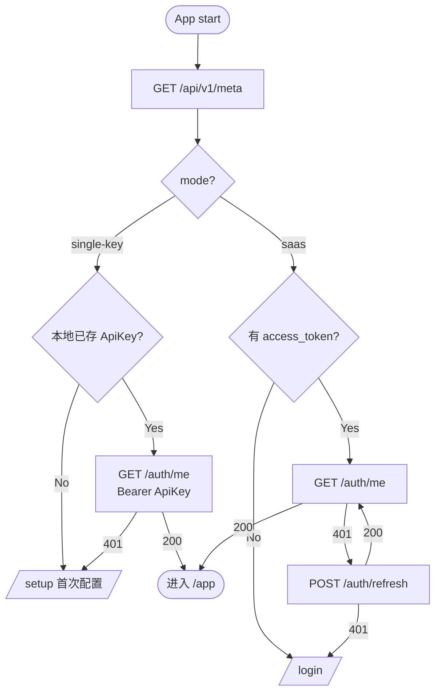
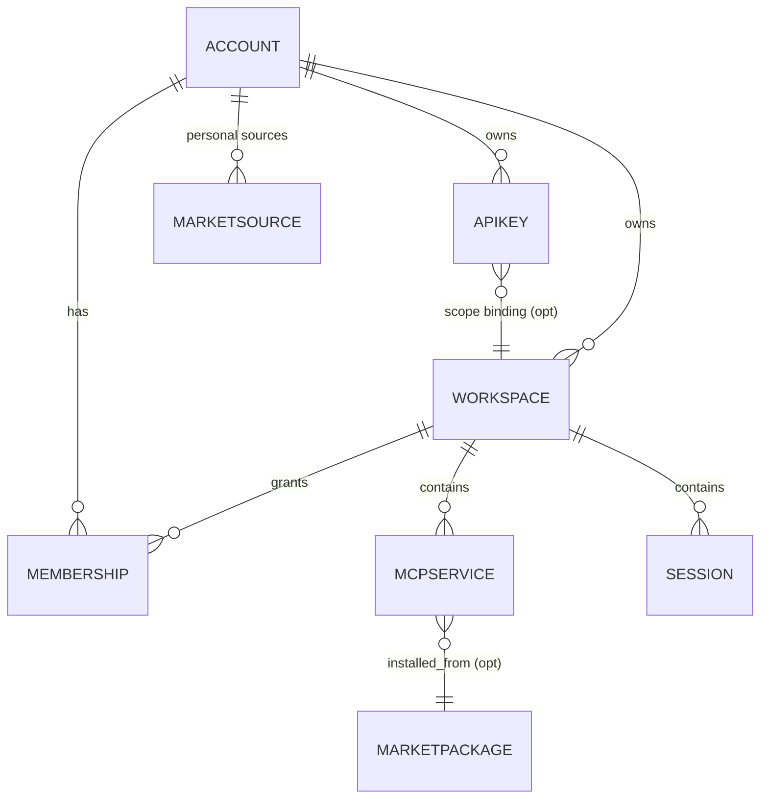

# MCP Gateway 管理控制台 — 产品设计与前端实现指南

> 本文档是 **MCP Gateway 管理控制台** 的产品设计 + 前后端接口契约。前端可独立基于本文档实现并用 mock 假数据跑通，后端再向此契约对齐。
>
> 读者假设：前端工程师 / 产品设计师，了解 React 与管理控制台常识，对 MCP 协议无需深入。

---

## 0. 如何使用

- 先读 §1–§5，建立整体理解。
- 做页面读 §6 + §8 对应接口。
- 做类型层读 §7 + §8。
- 后端未就绪时参照 §9 的 Mock 策略（MSW）。
- 未覆盖的字段前端自定并记录在 mock fixture 中，提交时列出待对齐项。

文档状态：**v1 初版**。

---

## 1. 产品定位

### 1.1 背景

- **MCP（Model Context Protocol）**：让 AI 客户端与工具服务器（文件系统、浏览器、数据库等）通信的开放协议。每个 MCP 服务器暴露若干 `tools`、`resources`、`prompts`。
- **MCP Gateway**：把多个 MCP 服务器聚合成统一入口的反向代理 + 控制面。

### 1.2 两部分

1. **流量面**（后端提供，前端不涉及）：MCP 协议入口 `/sse`、`/stream`、`/<service>` 等。
2. **控制面（本文档）**：Web 控制台，管理 Workspace / MCP / Session / 日志 / 调试 / 市场。

### 1.3 目标用户

| 画像 | 场景 |
| ---- | ---- |
| 个人开发者 | 本机或内网单实例网关 |
| 团队 DevOps | SaaS 平台下发给团队成员 |
| 平台管理员 | 跨账号运维、审计、配置 |

---

## 2. 运行模式

控制台**一套 UI、一套 API**，仅在登录/账号相关页按模式裁剪。

### 2.1 两种模式

| 模式 | 说明 | 用户体验 |
| ---- | ---- | -------- |
| `single-key` | 后端只认一个共享 API Key，无账号体系。前端把调用者当作内置 `admin`。 | 无登录页，输入一次 Key 即可；所有资源归属 `admin`。 |
| `saas` | 后端有账号 / 权限 / 多租户。 | 注册 / 登录 / OAuth / 个人 API Key / 多租户隔离。 |

### 2.2 前端启动流程

启动第一件事：`GET /api/v1/meta`（无需鉴权）。



### 2.3 前端裁剪差异

| 能力 | `single-key` | `saas` Developer | `saas` Owner |
| ---- | ------------ | ---------------- | ------------ |
| 登录 / 注册页 | 不显示（`/setup`） | ✅ | ✅ |
| 账号菜单 | 展示 `admin (single-key mode)` | ✅ | ✅ |
| 个人 API Key 管理 | 单 Key 展示 + 轮换 | 多 Key | 多 Key |
| Admin Console | 不显示 | ❌ | ✅ |
| 模式切换入口 | 不显示 | ❌ | ✅ |

### 2.4 鉴权头

所有 `/api/v1/**` 统一 `Authorization: Bearer <token>`：

- `single-key`：`token = 用户输入并存本地的 API Key`
- `saas` Web：`token = access_token`（`access_token` 放内存，`refresh_token` 由后端写 httpOnly cookie）
- 外部 MCP 客户端：`token = Personal API Key 的 raw_key`（见 §6.8）

---

## 3. 角色与权限

统一抽象 `Account`。`single-key` 模式只有内置 `admin`（`role=owner`）。

| 角色 | `role` | 范围 |
| ---- | ------ | ---- |
| Owner | `owner` | 平台所有资源、账号、配置 |
| Developer | `developer` | 自己的 Workspace / MCP / Session / API Key / 个人市场源 |
| Member（Phase 2） | `member` | 通过 Membership 加入他人 Workspace，按 `viewer / editor` 访问 |

权限矩阵：

| 资源 / 操作 | Owner | Developer 自有 | Developer 他人 |
| ----------- | ----- | -------------- | -------------- |
| Workspace CRUD | ✅ | ✅ | ❌ |
| MCP 部署 / 生命周期 | ✅ | ✅ | ❌ |
| Session 管理 | ✅ | ✅ | ❌ |
| 平台市场源读 | ✅ | ✅ | ✅ |
| 平台市场源写 | ✅ | ❌ | ❌ |
| 个人市场源 | ✅ | ✅（自己） | ❌ |
| 账号管理 | ✅ | ❌ | ❌ |
| Gateway Config 读写 | ✅ | 读部分 | ❌ |
| Audit Log | ✅ | ❌ | ❌ |

无权限时后端返回 `403 FORBIDDEN` / `FORBIDDEN_WORKSPACE`，前端显示"无权限"卡。

---

## 4. 信息架构与路由

### 4.1 路由树

```mermaid
graph LR
  ROOT[/] --> SETUP[/setup single-key 首次配置]
  ROOT --> LOGIN[/login saas]
  ROOT --> APP[/app]
  APP --> DASH[/app/overview]
  APP --> WSLIST[/app/workspaces]
  APP --> WS[/app/w/:ws]
  WS --> WSOV[overview]
  WS --> WSMCP[mcps]
  WSMCP --> WSMCPD[:name]
  WS --> WSSES[sessions]
  WS --> WSLOG[logs]
  WS --> WSSET[settings]
  APP --> MKT[/app/market]
  MKT --> MKTD[/app/market/:pkg]
  APP --> INST[/app/installed]
  APP --> KEY[/app/keys]
  APP --> PLAY[/app/playground]
  APP --> ACC[/app/account saas]
  APP --> ADM[/app/admin owner only]
  ADM --> ADMACC[accounts]
  ADM --> ADMWS[workspaces]
  ADM --> ADMAUD[audit]
  ADM --> ADMCFG[gateway-config]
```

### 4.2 侧边栏主导航

| 顺序 | 菜单 | 路径 | 可见 |
| ---- | ---- | ---- | ---- |
| 1 | Overview | `/app/overview` | 总是 |
| 2 | Workspaces | `/app/workspaces` | 总是 |
| 3 | Market | `/app/market` | `features.market=true` |
| 4 | Installed | `/app/installed` | 总是 |
| 5 | API Keys | `/app/keys` | 总是 |
| 6 | Playground | `/app/playground` | 总是 |
| 7 | Admin Console | `/app/admin` | saas + owner |

账号菜单（头像下拉）：Profile（saas）/ API Keys / Logout（saas）。

---

## 5. App Shell 与全局 UI 约定

### 5.1 三段式布局

- **Sidebar** 左，可折叠 64 / 240，用户偏好持久化
- **TopBar** 固定 56px 高：`Workspace Switcher | 全局搜索 ⌘K | 通知 | 头像`
- **Right Drawer**：MCP / Session 详情 / Debug，宽 520–720，可 pin
- **Main Content**：路由渲染

Workspace Switcher 切换时更新 URL 中 `:ws`，保留当前 Tab。

### 5.2 视觉与状态

状态色（仅语义）：
- running / healthy → 绿
- starting / syncing → 蓝
- stopped / idle → 灰
- failed / error → 红
- warning → 黄

通用组件：Badge、EmptyState、Skeleton、ErrorCard（含 `code` + `重试`）、ConfirmDangerDialog（要求输入目标名）。

### 5.3 其他

- i18n：全部文本资源化，默认中文，英文可切。
- A11y：交互元素 aria-label，全键盘可达。
- 时间展示：相对时间（`3 分钟前`）+ tooltip 绝对时间。

---

## 6. 页面详细设计

每页结构：**职责 / 布局 / 数据 / 交互 / 状态**。

### 6.1 首次配置 `/setup`（single-key）

- 职责：引导输入 API Key。
- 布局：居中卡片：标题"Connect to MCP Gateway" / 输入框"API Key"（密码，可切显示）/ 说明"配置在 gateway 的 config.json 的 `Auth.ApiKey`" / "Continue" 按钮。
- 交互：提交 → `localStorage.mcp_gateway_api_key` 存 → `GET /api/v1/auth/me` 验证 → 跳 `/app/overview`；失败提示 "Invalid API Key"。
- 状态：初始 / 验证中 / 验证失败。

### 6.2 登录 `/login`（saas）

- 布局：左 40% 品牌区；右 60% 表单：Email、Password、Remember me、`Sign in`；下方"or continue with"+ OAuth 按钮；底部 `Forgot password?` / `Create account`（`allow_register=true` 时）。
- 交互：
  - 提交 → `POST /api/v1/auth/login` → 成功存 `access_token`（内存）+ 跳 `/app/overview`。
  - OAuth → `window.location = /api/v1/auth/oauth/:provider/start?redirect=...`；回调页 `/auth/callback` 用 `code` 换 token。
- 状态：初始 / 提交中 / 凭据错误 / 账号被禁用 / 需验证邮箱。

### 6.3 Overview `/app/overview`

- 职责：跨 Workspace 总览。
- 布局：
  - 顶部 4 张统计卡：Workspaces / Running MCPs / Active Sessions / Failed MCPs (24h)
  - 中部双列：左 `Recent Activity`（时间轴 20 条）/ 右 `My Workspaces`（最多 6 卡）
  - 底部 Quick Actions：`+ New Workspace` / `Browse Market` / `New API Key` / `Open Playground`
- 数据：`GET /api/v1/stats/overview`
- 空状态：零 Workspace 时三步向导：Create Workspace → Install from Market → Copy connect snippet。

### 6.4 Workspaces 列表 `/app/workspaces`

- 过滤条：搜索 / Status / Owner（owner 视图）/ 刷新 / `+ New Workspace`
- 表格：Name / ID / Owner / Status / #MCP / #Session / Created / Last Activity / ⋯
- 数据：`GET /api/v1/workspaces?scope=mine|all&status=&q=&page=&page_size=`
- 创建对话框：`Name`(1-64)、`ID`(可选，默认 slug；a-z0-9-，3-32)、`Description`(可选 <200)
- 删除：输入 Workspace 名称完全一致确认；可勾选"同时停止并删除所有 MCP"

### 6.5 Workspace 详情 `/app/w/:ws/*`

5 Tab：`Overview` | `MCPs` | `Sessions` | `Logs` | `Settings`。Workspace Switcher 切换时保留当前 Tab。

#### 6.5.1 Overview

- 三张状态卡：Running / Failed / Active Sessions
- MCPs 迷你列表（前 5）+ "View all"
- `Connect` 卡：按 `meta.gateway_protocol` 生成可复制片段（Shell curl / Node / Python / Inspector）
- Danger Zone：删除 Workspace

#### 6.5.2 MCPs

- 行动区：`+ Deploy MCP`（`From Market` / `From Config`）/ `Import JSON`（批量）/ `Refresh` / 卡片/表格切换
- 卡片：服务名 + 来源徽标 + 状态徽标 + `#tools` + last_error 单行 + 操作行（Restart / Stop / Logs / Debug / Config / Delete）
- 点击进入 `/app/w/:ws/mcps/:name`（Drawer 或整页）
- 数据：`GET /api/v1/workspaces/:ws/services`
- 部署三选一：
  - `From Market`：嵌入市场搜索 → 选包 → 配置 env/args → 提交
  - `From Config`：Command + Args + Env，或切到 URL
  - `Import JSON`：粘贴 `{"mcpServers":{...}}`

##### MCP 详情 `/app/w/:ws/mcps/:name`

- Header：服务名 / 状态 / 来源 / 版本 / Restart / Stop / Delete
- Tabs：
  - **Info**：Command/URL / Args / Env（敏感遮罩）/ Port / Created
  - **Tools**：从 `tools/list` 缓存渲染
  - **Logs**：tail + follow + 级别过滤
  - **Debug**：嵌入 Playground（目标锁定当前 MCP）

#### 6.5.3 Sessions

- 过滤：Status（active / idle / closed）/ 时间范围 / 搜索 id
- 表格：ID / Status / Created / Last Receive / Tools Ready / Tools Count / Bound MCPs / ⋯
- `+ New Session` 后复制 `Mcp-Session-Id`
- Drawer：订阅 MCP 列表 / 工具数 / 最近 10 条 JSON-RPC 摘要
- 数据：`GET /api/v1/workspaces/:ws/sessions`

#### 6.5.4 Logs

- 左侧 MCP 多选 + 级别过滤 + Follow 切换
- 主区 virtualized viewer，支持搜索 / 跳行 / 下载 / 清空
- 数据：`GET /logs?tail=&since=&level=`；follow 用 SSE `GET /logs/stream`

#### 6.5.5 Settings

- Name / Description 可编辑
- Default MCP 部署模板（env / log 路径）
- Members（saas Phase 2）
- Danger Zone：删除 / 转让 Owner

### 6.6 Market `/app/market`

- 布局：顶部搜索 + Source 多选 + Category + Sort（Popular / Recent / Rating）
- 左 rail：Source / Category 列表
- 主区：包卡片网格（名称 / 简述 / 作者 / ⭐ Rating / ⬇ Downloads / 版本）；无限滚动
- 数据：`GET /api/v1/market/packages?q=&source=&category=&sort=&page=`

#### 6.6.1 Package 详情 `/app/market/:pkg`

- Header：名称 / 版本 / 作者 / Rating / Downloads / Tags / Verified
- Primary：`Install to workspace ▾`（列出有写权限的 ws）/ `⭐ Favorite`
- Tabs：Readme / Tools / Install / Versions / Feedback(Phase 3)
- 数据：`GET /api/v1/market/packages/:id`

### 6.7 Installed `/app/installed`

- 表格：Package / Version（有更新时红点）/ Workspace / Status / Installed At / 操作（Update / Uninstall / Go to）
- 数据：`GET /api/v1/installed`

### 6.8 API Keys `/app/keys`

#### single-key

- 顶部警告条：`Gateway is running in single-key mode. The key below is shared across all clients.`
- 展示：Current API Key（遮罩 + Reveal + Copy）/ Updated At
- `Rotate Key`：二次确认 → 成功后一次性弹窗展示新值，要求"I've copied it"才可关
- 数据：`GET /api/v1/system/api-key` / `POST /api/v1/system/api-key/rotate`

#### saas

- 行动区：`+ Create API Key`
- 表格：Name / Prefix****Suffix / Scope（`admin` | `workspace:<id>`）/ Last Used / Expires / Created / ⋯
- 创建对话框：Name / Scope（Full account | Specific workspace）/ Workspace / Expiry（Never / 30d / 90d / 365d / Custom）
- 提交后一次性展示 `raw_key` + "I've copied it" 关闭
- 数据：§8.8

### 6.9 Playground `/app/playground`

三栏：

- 左：Workspace / MCP / Session（Auto-create）/ 协议切换（SSE / Streamable HTTP）
- 中：请求编辑器
  - 模板下拉：`initialize` / `tools/list` / `tools/call` / `resources/list` / `prompts/list` / `Custom`
  - `tools/call` 时按 `inputSchema` 自动生成参数表单
  - `Send`
- 右：响应视图（JSON tree / Raw 切换）+ 历史（最近 20 条，可回放）+ "Copy as curl/Node/Python"
- 数据：Session 与 MCP 列表走 §8.4 / §8.5；调用本身走流量面入口（前端直接 fetch）

### 6.10 Account `/app/account`（saas）

子 Tab：

- **Profile**：Email（只读）/ Display name / Change password / OAuth bindings / Enable 2FA
- **Active Sessions**：浏览器会话列表（IP / UA / Last Active / 终止）
- **Billing**：Phase 3 占位

### 6.11 Admin Console `/app/admin`（owner）

- **Accounts**：表格 Email / Name / Role / Status / Workspaces / Created / 操作（Disable / Reset password / Change role）
- **All Workspaces**：跨账号 ws 表；进入"影子模式"URL 同 Developer 视图，但 TopBar 显 `You are viewing {owner}'s workspace (read-only)`；切"接管模式"需输入密码
- **Audit Log**：时间 / 账号 / 动作 / 资源 / 结果 / IP / UA；筛选 + 导出
- **Gateway Config**：`gateway_protocol` / `session_gc_interval` / `mcp_retry_count` / `auth.enabled` / `auth.mode`；`auth.mode` 切换危险操作，需密码 + 选择保留 Owner

---

## 7. 数据模型

### 7.1 实体 ER



### 7.2 字段

#### Account

| 字段 | 类型 | 说明 |
| ---- | ---- | ---- |
| id            | string   | 主键。`single-key` 下固定 `"admin"` |
| email         | string   | 唯一；`admin` 为空串 |
| display_name  | string   | |
| role          | enum     | `owner` / `developer` / `member` |
| status        | enum     | `active` / `disabled` |
| builtin       | boolean  | `true` 表示内置 admin |
| created_at    | ISO-8601 | |

```json
{ "id": "admin", "email": "", "display_name": "Administrator",
  "role": "owner", "status": "active", "builtin": true,
  "created_at": "2025-01-01T00:00:00Z" }
```

#### Workspace

| 字段 | 类型 | 说明 |
| ---- | ---- | ---- |
| id               | string   | slug |
| name             | string   | |
| description      | string   | |
| owner_id         | string   | Account.id |
| status           | enum     | `running` / `stopped` / `failed` |
| mcp_count        | int      | 冗余 |
| session_count    | int      | 冗余 |
| created_at       | ISO-8601 | |
| last_activity_at | ISO-8601 | |

```json
{ "id": "ws_demo", "name": "Demo Workspace", "description": "My sandbox",
  "owner_id": "admin", "status": "running",
  "mcp_count": 3, "session_count": 1,
  "created_at": "2025-03-10T08:00:00Z",
  "last_activity_at": "2025-04-19T02:15:00Z" }
```

#### McpService

| 字段 | 类型 | 说明 |
| ---- | ---- | ---- |
| name           | string   | 在 workspace 内唯一 |
| workspace_id   | string   | |
| source_type    | enum     | `command` / `url` / `market` |
| source_ref     | string   | 市场包 id 或空 |
| command        | string?  | |
| args           | string[] | |
| env            | map<string,string> | |
| url            | string?  | |
| status         | enum     | `starting` / `running` / `stopped` / `failed` |
| port           | int?     | |
| tools_count    | int      | |
| last_error     | string?  | |
| retry_count    | int      | |
| created_at     | ISO-8601 | |

```json
{ "name": "time", "workspace_id": "ws_demo",
  "source_type": "command", "source_ref": "",
  "command": "uvx",
  "args": ["mcp-server-time", "--local-timezone=Asia/Shanghai"],
  "env": { "TZ": "Asia/Shanghai" }, "url": "",
  "status": "running", "port": 34101, "tools_count": 2,
  "last_error": null, "retry_count": 0,
  "created_at": "2025-04-18T12:00:00Z" }
```

#### Session

| 字段 | 类型 | 说明 |
| ---- | ---- | ---- |
| id                | string   | `Mcp-Session-Id` |
| workspace_id      | string   | |
| status            | enum     | `active` / `idle` / `closed` |
| is_ready          | boolean  | |
| tools_count       | int      | |
| bound_mcp_names   | string[] | |
| created_at        | ISO-8601 | |
| last_receive_time | ISO-8601 | |

#### ApiKey

| 字段 | 类型 | 说明 |
| ---- | ---- | ---- |
| id            | string   | |
| account_id    | string   | |
| name          | string   | |
| prefix        | string   | 展示用（如 `mkg_live_abcd`） |
| scope         | enum     | `admin` / `workspace` |
| workspace_id  | string?  | 当 scope=workspace |
| last_used_at  | ISO-8601? | |
| expires_at    | ISO-8601? | null = 永不过期 |
| created_at    | ISO-8601 | |

> `raw_key` 仅在创建返回中出现一次，后续任何查询都不返回。

#### MarketPackage

| 字段 | 类型 | 说明 |
| ---- | ---- | ---- |
| id           | string   | 如 `filesystem-tools` |
| name         | string   | |
| version      | string   | 语义化版本 |
| description  | string   | |
| author       | string   | |
| tags         | string[] | |
| rating       | number   | 0–5 |
| downloads    | int      | |
| verified     | boolean  | |
| source_id    | string   | 市场源 id |
| install      | object   | `{ type: "uvx|npm|docker|url", command, args[], env{} }` |
| tools        | string[] | |
| readme       | string   | markdown，详情才返回 |

#### AuditLog

| 字段 | 类型 |
| ---- | ---- |
| id | string |
| at | ISO-8601 |
| actor_account_id | string |
| actor_email | string |
| action | string（如 `workspace.delete`、`api_key.create`、`auth.mode.switch`） |
| resource_type | string |
| resource_id | string |
| result | `success` / `failure` |
| ip | string |
| user_agent | string |
| metadata | object |

---

## 8. API 契约（v1）

### 8.1 基础约定

- **Base URL**：`${VITE_API_BASE || ''}/api/v1`
- **Content-Type**：`application/json; charset=utf-8`
- **时间**：ISO-8601 UTC
- **分页**：`page`（1-based）、`page_size`（默认 20 / 最大 100）、`sort`（字段名，前加 `-` 降序）
- **搜索**：`q=关键字`
- **鉴权**：`Authorization: Bearer <token>`（见 §2.4）

#### 响应包络

成功：

```json
{ "success": true, "data": {}, "error": null, "timestamp": "2025-04-19T02:15:00Z" }
```

失败：

```json
{ "success": false, "data": null,
  "error": { "code": "FORBIDDEN", "message": "...", "details": {} },
  "timestamp": "2025-04-19T02:15:00Z" }
```

列表 `data` 统一：

```json
{ "items": [], "total": 0, "page": 1, "page_size": 20 }
```

#### 错误码

| code | HTTP | 含义 |
| ---- | ---- | ---- |
| `UNAUTHORIZED` | 401 | 未登录 / token 失效 |
| `INVALID_CREDENTIALS` | 401 | 账号或密码错误 |
| `FORBIDDEN` | 403 | 权限不足 |
| `FORBIDDEN_WORKSPACE` | 403 | 无权访问指定 Workspace |
| `ACCOUNT_DISABLED` | 403 | 账号被禁用 |
| `FEATURE_DISABLED` | 409 | 当前模式不支持（如 single-key 下调 `/api-keys`） |
| `NOT_FOUND` | 404 | |
| `WORKSPACE_NOT_FOUND` | 404 | |
| `CONFLICT` | 409 | 资源冲突（重名等） |
| `VALIDATION_ERROR` | 422 | 入参校验失败 |
| `MCP_DEPLOY_FAILED` | 500 | 部署失败 |
| `RATE_LIMITED` | 429 | |
| `INTERNAL_ERROR` | 500 | |

### 8.2 Meta & Auth

#### `GET /api/v1/meta`  *(无鉴权)*

```json
{ "success": true, "data": {
  "mode": "saas",
  "allow_register": true,
  "oauth_providers": ["github"],
  "gateway_protocol": "streamhttp",
  "version": "1.2.0",
  "features": { "market": true, "team": false, "audit_log": true }
}}
```

#### `POST /api/v1/auth/login`  *(saas)*

Body：

```json
{ "email": "alice@example.com", "password": "pass1234", "remember": true }
```

200：

```json
{ "success": true, "data": {
  "access_token": "eyJhbGciOi...", "token_type": "Bearer", "expires_in": 7200,
  "account": { "id": "acc_001", "email": "alice@example.com",
    "display_name": "Alice", "role": "developer",
    "status": "active", "builtin": false,
    "created_at": "2025-01-10T00:00:00Z" }
}}
```

可能错误：`INVALID_CREDENTIALS` / `ACCOUNT_DISABLED` / `RATE_LIMITED`。

#### `POST /api/v1/auth/register`  *(saas + allow_register)*

Body：`{ "email": "...", "password": "...", "display_name": "..." }`
201：同 login。

#### `POST /api/v1/auth/logout`

200：`{ "success": true, "data": null }`

#### `POST /api/v1/auth/refresh`

cookie 携带 refresh token。200：返回新的 `access_token` / `expires_in`。

#### `GET /api/v1/auth/me`

200（saas）：返回当前账号对象。
200（single-key 合法 Bearer）：返回内置 `admin` 账号。

#### OAuth

- `GET /api/v1/auth/oauth/:provider/start?redirect=/app/overview` → 302
- `POST /api/v1/auth/oauth/:provider/exchange`  Body：`{ "code": "..." }`  响应同 login

### 8.3 Workspaces

#### `GET /api/v1/workspaces`

Query：`scope=mine|all`、`status`、`q`、`page`、`page_size`、`sort`

200：

```json
{ "success": true, "data": {
  "items": [
    { "id": "ws_demo", "name": "Demo Workspace", "description": "My sandbox",
      "owner_id": "admin", "status": "running",
      "mcp_count": 3, "session_count": 1,
      "created_at": "2025-03-10T08:00:00Z",
      "last_activity_at": "2025-04-19T02:15:00Z" }
  ],
  "total": 1, "page": 1, "page_size": 20
}}
```

#### `POST /api/v1/workspaces`

Body：`{ "id": "ws_demo", "name": "Demo", "description": "optional" }`（`id` 可省略）
201：单个 Workspace 对象。

#### `GET /api/v1/workspaces/:ws`

200：Workspace + `mcps`（前 5 McpService 摘要）+ `sessions_active`。

#### `PATCH /api/v1/workspaces/:ws`

Body：`{ "name": "New", "description": "..." }`  200：Workspace。

#### `DELETE /api/v1/workspaces/:ws`

Query：`cascade=true` 级联删除 MCP。200：`{ "id": "ws_demo" }`。

### 8.4 MCP Services

#### `GET /api/v1/workspaces/:ws/services`

200：items = McpService[]。

#### `POST /api/v1/workspaces/:ws/services`

Body 三选一：

```jsonc
// Market
{ "name": "fs", "market_package_id": "filesystem-tools", "version": "1.2.0",
  "env": { "FS_ROOT": "/tmp" } }

// Command
{ "name": "time", "command": "uvx",
  "args": ["mcp-server-time", "--local-timezone=Asia/Shanghai"],
  "env": { "TZ": "Asia/Shanghai" } }

// URL
{ "name": "remote", "url": "http://mcp.example.com/sse" }
```

201：McpService，`status` 初始 `starting`。

#### `POST /api/v1/workspaces/:ws/services:batch`

Body：`{ "mcpServers": { "time": {...}, "fs": {...} } }`（值同上三选一）

200：

```json
{ "success": true, "data": {
  "summary": { "total": 2, "deployed": 1, "existed": 1, "replaced": 0, "failed": 0 },
  "results": {
    "time": { "status": "deployed", "message": "ok" },
    "fs":   { "status": "existed",  "message": "already running" }
  }
}}
```

#### `PUT /api/v1/workspaces/:ws/services/:name`

Body：同 POST 的 command / url 变体。200：更新后的 McpService。

#### `POST /api/v1/workspaces/:ws/services/:name/start|stop|restart`

200：`{ "status": "running" }`。

#### `DELETE /api/v1/workspaces/:ws/services/:name`

200：`{ "name": "time" }`。

#### `GET /api/v1/workspaces/:ws/services/:name/tools`

200：

```json
{ "success": true, "data": { "items": [
  { "name": "get_current_time", "description": "...", "input_schema": { "type": "object", "properties": {} } }
] } }
```

#### `GET /api/v1/workspaces/:ws/services/:name/logs`

Query：`tail=200`、`since=ISO`、`level=debug|info|warn|error`

200：

```json
{ "success": true, "data": {
  "service_name": "time", "total_lines": 200,
  "logs": [
    { "timestamp": "2025-04-19T02:15:00Z", "level": "info", "message": "tools/list ok" }
  ]
}}
```

#### `GET /api/v1/workspaces/:ws/services/:name/logs/stream`

协议：`text/event-stream`。每条 `event: log`，`data` 为 LogEntry JSON。由于 `EventSource` 不支持自定义头，前端 URL 带 `?api_key=<token>` 或用 `fetch` + `ReadableStream`。

### 8.5 Sessions

#### `GET /api/v1/workspaces/:ws/sessions`

Query：`status`、`q`、`page`、`page_size`

200：items = Session[]。

#### `POST /api/v1/workspaces/:ws/sessions`

Body：`{}`（可选 `"bind_mcps": ["time"]`）  201：Session。

#### `DELETE /api/v1/workspaces/:ws/sessions/:id`

200。

#### `GET /api/v1/sessions/:id`

200：Session + `recent_messages`（最近 10 条 JSON-RPC 摘要）。

### 8.6 Market

#### `GET /api/v1/market/sources`

200：

```json
{ "success": true, "data": {
  "items": [
    { "id": "official", "name": "MCP Official Registry",
      "url": "https://registry.mcp.dev", "trusted": true, "enabled": true,
      "priority": 1, "scope": "platform",
      "total_packages": 45, "last_synced": "2025-04-19T00:00:00Z",
      "status": "healthy" }
  ],
  "total": 1
}}
```

#### `POST /api/v1/market/sources`

Body：`{ "name": "Private", "url": "https://...", "priority": 10, "scope": "personal" }`  201：源对象。

#### `PATCH /api/v1/market/sources/:id` / `DELETE /api/v1/market/sources/:id`

#### `POST /api/v1/market/sources/:id/sync`

202：`{ "sync_id": "sync_01", "status": "in_progress" }`。

#### `GET /api/v1/market/packages`

Query：`q`、`source`（逗号分隔多个）、`category`、`sort=popular|recent|rating`、`page`、`page_size`

200：items = MarketPackage 摘要（不含 `readme`）。

#### `GET /api/v1/market/packages/:id`

200：完整 MarketPackage（含 `readme`、`versions[]`、`tools[]`）。

### 8.7 Installed

#### `GET /api/v1/installed`

200：

```json
{ "success": true, "data": {
  "items": [
    { "package_id": "filesystem-tools", "package_name": "Filesystem Tools",
      "installed_version": "1.2.0", "latest_version": "1.3.0",
      "workspace_id": "ws_demo", "workspace_name": "Demo",
      "service_name": "fs", "status": "running",
      "installed_at": "2025-04-15T10:00:00Z" }
  ], "total": 1
}}
```

### 8.8 API Keys (saas)

#### `GET /api/v1/api-keys`

200：items = ApiKey[]（不含 raw_key）。

#### `POST /api/v1/api-keys`

Body：

```json
{ "name": "agent-laptop", "scope": "workspace",
  "workspace_id": "ws_demo", "expires_in_days": 90 }
```

201：

```json
{ "success": true, "data": {
  "id": "key_01", "account_id": "acc_001", "name": "agent-laptop",
  "prefix": "mkg_live_abcd", "scope": "workspace", "workspace_id": "ws_demo",
  "expires_at": "2025-07-18T00:00:00Z", "created_at": "2025-04-19T00:00:00Z",
  "last_used_at": null,
  "raw_key": "mkg_live_abcd1234ef567890xyz"
}}
```

#### `DELETE /api/v1/api-keys/:id`

### 8.9 Single-key 专用

#### `GET /api/v1/system/api-key`

saas 模式返回 `FEATURE_DISABLED`。single-key 200：

```json
{ "success": true, "data": { "api_key": "123456", "updated_at": "2025-01-01T00:00:00Z" } }
```

#### `POST /api/v1/system/api-key/rotate`

single-key 200：`{ "api_key": "newvalue", "updated_at": "..." }`（仅此一次返回明文）。

### 8.10 System Config

#### `GET /api/v1/system/config`

200：

```json
{ "success": true, "data": {
  "bind": "[::]:8080",
  "gateway_protocol": "streamhttp",
  "session_gc_interval_seconds": 10,
  "proxy_session_timeout_seconds": 60,
  "mcp_retry_count": 3,
  "auth": { "enabled": true, "mode": "saas", "allow_register": true }
}}
```

#### `PUT /api/v1/system/config`

Body：部分字段更新，后端校验白名单。200：更新后的 config。

### 8.11 Stats

#### `GET /api/v1/stats/overview`

Query：`scope=mine|all`

200：

```json
{ "success": true, "data": {
  "workspaces_count": 3,
  "running_mcps": 7,
  "failed_mcps_24h": 1,
  "active_sessions": 2,
  "recent_activity": [
    { "at": "2025-04-19T02:00:00Z", "type": "mcp.failed",
      "workspace_id": "ws_demo", "workspace_name": "Demo",
      "service_name": "time", "message": "exit code 1" },
    { "at": "2025-04-19T01:30:00Z", "type": "session.created",
      "workspace_id": "ws_demo", "workspace_name": "Demo",
      "session_id": "sess_xyz" }
  ]
}}
```

### 8.12 Admin (saas + owner)

#### `GET /api/v1/admin/accounts`

Query：`q`、`role`、`status`、分页。
200：items = Account[] + 冗余 `workspaces_count`、`last_login_at`。

#### `PATCH /api/v1/admin/accounts/:id`

Body：`{ "status": "disabled" }` 或 `{ "role": "owner" }` 或 `{ "reset_password": true }`
200：Account（重置密码时额外返回一次性 `temp_password`）。

#### `GET /api/v1/admin/workspaces`

Query：`q`、`owner_id`、分页。200：Workspace[] + 冗余 `owner_email`。

#### `GET /api/v1/admin/audit-log`

Query：`q`、`actor_account_id`、`action`、`from`、`to`、分页。200：AuditLog[]。

---

## 9. 前端工程建议

> 建议，非强制。

- **栈**：React 19 + TypeScript 5 + Vite
- **UI 库**：MUI / Ant Design / Radix + Tailwind + shadcn 任选，保持一套 token
- **状态**：Auth / Meta / 用户信息用 `zustand` 或 Context；远程数据用 `@tanstack/react-query`
- **路由**：React Router 6+，Workspace 详情 5 Tab 用嵌套路由
- **API 层**：
  - 统一实例 + 请求拦截器注入 `Authorization`
  - 响应拦截器解 `envelope.data`；失败抛带 `code/message` 的 Error
  - 401：saas 先试 `refresh`，失败跳 `/login`；single-key 跳 `/setup`
- **类型**：§7 + §8 对应写 TS 接口在 `shared/types/`

### 9.1 目录建议

```
web/
  src/
    app/                  # 路由 + 布局 + guard + bootstrap
      bootstrap.ts        # meta + me
      router.tsx
      guards.tsx
      layout/
        Shell.tsx
        TopBar.tsx
        Sidebar.tsx
        WorkspaceSwitcher.tsx
    features/
      auth/ { pages, hooks, api }
      workspaces/
      mcps/
      sessions/
      logs/
      market/
      installed/
      keys/
      playground/
      admin/
    shared/
      api/ { client.ts, envelope.ts }
      components/         # Button, Badge, EmptyState, ConfirmDialog, JsonViewer...
      hooks/
      i18n/
      types/
    mocks/                # 见 §10
```

### 9.2 路由 Guard 伪代码

```ts
function AppGuard({ children }: { children: React.ReactNode }) {
  const meta = useMeta()
  const me = useMe()

  if (!meta) return <SplashLoading />
  if (meta.mode === 'single-key') {
    if (!localStorage.getItem('mcp_gateway_api_key')) return <Navigate to="/setup" />
    if (!me) return <SplashLoading />
    return <>{children}</>
  }
  if (!me) return <Navigate to="/login" />
  return <>{children}</>
}
```

### 9.3 错误处理

- 顶层 `ErrorBoundary` + 全局 toast：把 `error.code` 映射为用户可读文案
- `FEATURE_DISABLED` 不 toast，而是隐藏触发入口（说明该模式不支持）

---

## 10. Mock 策略

前端先行。推荐 **MSW（Mock Service Worker）** 拦截 `/api/v1/**`。

### 10.1 目录

```
src/mocks/
  browser.ts            # setupWorker(...handlers)
  server.ts             # setupServer(...handlers)  for vitest
  handlers/
    meta.ts
    auth.ts
    workspaces.ts
    services.ts
    sessions.ts
    market.ts
    keys.ts
    stats.ts
    admin.ts
  fixtures/
    accounts.ts
    workspaces.ts
    services.ts
    sessions.ts
    packages.ts
    logs.ts
```

### 10.2 开关

- 环境变量：`VITE_USE_MOCK=1` 启用 MSW
- Dev 浮层（右下角）：Mode 切换（single-key ↔ saas）/ 模拟延迟 / 模拟错误率 / 强制某接口失败

### 10.3 模式 mock 示例

```ts
// handlers/meta.ts
import { rest } from 'msw'
export const metaHandlers = [
  rest.get('/api/v1/meta', (_req, res, ctx) => {
    const mode = localStorage.getItem('mock_mode') || 'single-key'
    return res(ctx.json({
      success: true,
      data: {
        mode,
        allow_register: true,
        oauth_providers: mode === 'saas' ? ['github'] : [],
        gateway_protocol: 'streamhttp',
        version: '1.0.0-mock',
        features: { market: true, team: false, audit_log: mode === 'saas' }
      },
      error: null,
      timestamp: new Date().toISOString()
    }))
  })
]
```

`auth.ts` 在 `single-key` 模式下，任何非空 Bearer 即命中 admin 账号；`saas` 模式下校验固定账号列表。

### 10.4 Fixture 规模建议

- Workspaces：3 个（1 running 多 MCP / 1 stopped / 1 failed）
- MCPs：每 Workspace 2–5 个，覆盖 4 种状态、3 种来源
- Sessions：每 Workspace 0–3 个
- Packages：10 个，覆盖不同 rating / downloads / verified / category
- AuditLog：30 条，覆盖所有 action 类型
- Logs：单 MCP 准备 200 行，支持 `?tail=` 过滤

### 10.5 异常 / 慢请求 mock

- Dev 浮层：Simulate latency（0 / 200 / 500 / 2000 ms）、Simulate error rate（0% / 10% / 100%）
- URL 注入：`?mock_fail=workspaces.create` 强制特定接口失败

### 10.6 流式 mock

对 `GET /logs/stream`（SSE），MSW 支持返回 `ReadableStream`；fixture 以 1s 节奏推送一条假 log。

---

## 11. 前端里程碑

| 阶段 | 目标 | 交付 |
| ---- | ---- | ---- |
| **M1 · App Shell + Mock** | 建立 shell、路由、guard、mock 基础；single-key 可完整跑 | Sidebar / TopBar / WorkspaceSwitcher / Setup / Overview / Workspaces 列表 |
| **M2 · Workspace 详情** | 5 Tab + MCP 详情 Drawer + 连接片段 | MCPs / Sessions / Logs / Settings |
| **M3 · Market & Installed** | 安装流 + 已安装聚合 | Market 列表 / 详情 + Install to workspace + Installed |
| **M4 · Playground** | 调试台 | 三栏 + 模板 + 历史 + 导出 curl/Node/Python |
| **M5 · API Keys** | single-key 与 saas 形态 | 列表 / 创建 / 撤销 / 一次性展示 |
| **M6 · SaaS 身份** | 登录 / 注册 / OAuth / Account | Login / Register / Profile / Active sessions |
| **M7 · Admin Console** | Owner 管理台 | Accounts / All Workspaces / Audit Log / Gateway Config |
| **M8 · 联调 & 打磨** | 替换 MSW 为真实后端 | 错误态 / 空态 / i18n / A11y 终版 |

---

## 12. 验收要点

- `meta.mode=single-key`：无登录页；未存 key 跳 `/setup`；`/app/account`、`/app/admin` 菜单隐藏。
- `meta.mode=saas`：未登录必跳 `/login`；登录后 `/app/overview` 可用；owner 可见 `/app/admin`。
- Workspace Switcher 切换时：`:ws` 变更但当前 Tab 保留。
- API Key 创建：`raw_key` 仅在创建响应中可见一次，模态关闭后无法再读取。
- 部署 MCP：三种来源（market / command / url）前端先行校验，互斥。
- Playground：Session 自动创建并离开时释放或提示保留。
- Admin 影子模式：默认只读，TopBar 警告条醒目，写操作需再次确认。
- 错误处理：统一响应包络解析；`FEATURE_DISABLED` 不弹 toast，改为隐藏入口。
- 所有删除 / 撤销 / 模式切换：强制二次确认（输入目标名称）。
- 所有列表均能展示：初始骨架 / 空态 / 错误态 / 分页。
